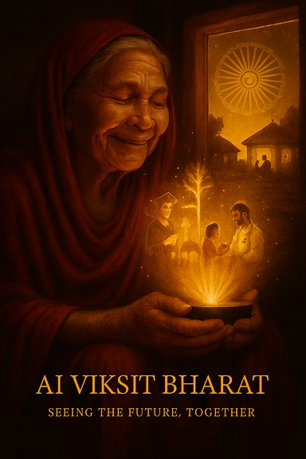

# 🌟 AI Viksit Bharat — Seeing the Future, Together 🌟

## Tagline
Not robots or drones, but human emotion — from unseen dreams to glowing realities.  
AI Viksit Bharat is about turning invisible dreams into visible light, together.

## Artist’s Statement
As a Computer Engineering student from G. Pullareddy Engineering College, I wanted to portray a vision of AI Viksit Bharat that goes beyond technology — one that touches the heart.

This portrait captures an elderly blind grandmother in a humble village home, holding a glowing AI device that projects the dreams she could never see: her granddaughter graduating, clean water flowing into her village, and a doctor treating her family via AI telemedicine.

Her gentle smile reflects the emotional power of AI as a bridge between generations, dreams, and realities. The warm golden glow, deep crimson palette, and glowing Ashoka Chakra symbolize India’s heritage and its luminous future. The floating golden particles represent hope and transformation — the invisible magic of AI made visible.

✨ This is not just a portrait. It’s a tribute to every unseen dream that AI can help realize.

## Artwork
*(Upload your image into an `artwork/` folder and link it here)*  

## License
This project is licensed under the MIT License — feel free to share and adapt with attribution.
